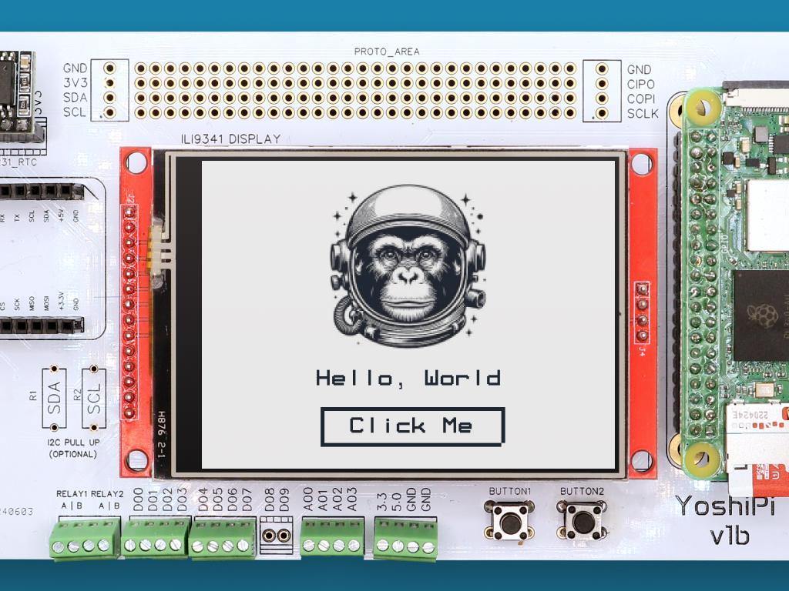
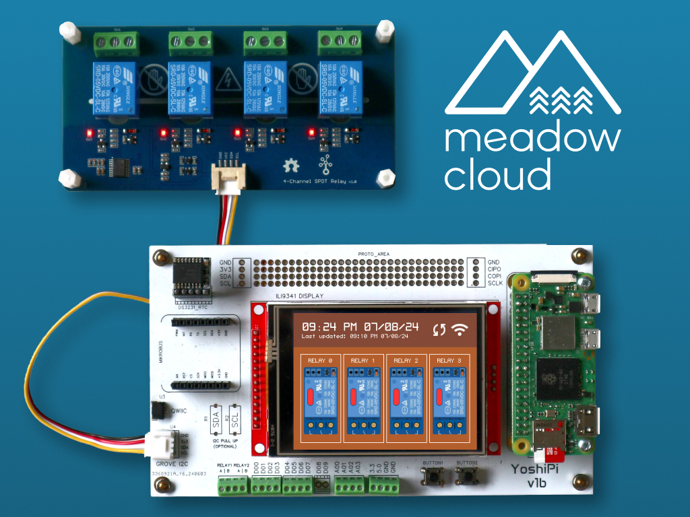

 

# Yoshipi.Samples

Project Samples:

<table>
    <tr>
        <td>
             
            Basic YoshiPi app with a touch-capable display  
            <a href="Source/HelloYoshipi/">Source Code</a>
        </td>
        <td>
             
            Get weather forecast using Meadow on a YoshiPi  
            <a href="Source/WifiWeather/">Source Code</a>
        </td>
        <td>
             
            Send telemetry data to Meadow.Cloud on a YoshiPi  
            <a href="Source/MeadowCloudLogging/">Source Code</a>
        </td>
    </tr>
    <tr>
        <td>
             
            Send and graph environmental data with Azure IoT Hub 
            <a href="Source/AzureIoTHubLogging/">Source Code</a>
        </td>
        <td>
             
            Control a 4-channel relay on an interactive HMI with a touchscreen  
            <a href="Source/GroveRelayController/">Source Code</a>
        </td>
        <td>
             
            Control a 4-channel relay using Commands from Meadow.Cloud  
            <a href="Source/MeadowCloudCommands/">Source Code</a>
        </td>
    </tr>
    <tr>
        <td>
            
&nbsp;&nbsp;&nbsp;&nbsp;&nbsp;&nbsp;&nbsp;&nbsp;&nbsp;&nbsp;&nbsp;&nbsp;&nbsp;&nbsp;&nbsp;&nbsp;&nbsp;&nbsp;&nbsp;&nbsp;&nbsp;&nbsp;&nbsp;&nbsp;&nbsp;&nbsp;&nbsp;&nbsp;&nbsp;&nbsp;&nbsp;&nbsp;

        </td>
        <td>
            
&nbsp;&nbsp;&nbsp;&nbsp;&nbsp;&nbsp;&nbsp;&nbsp;&nbsp;&nbsp;&nbsp;&nbsp;&nbsp;&nbsp;&nbsp;&nbsp;&nbsp;&nbsp;&nbsp;&nbsp;&nbsp;&nbsp;&nbsp;&nbsp;&nbsp;&nbsp;&nbsp;&nbsp;&nbsp;&nbsp;&nbsp;&nbsp;

        </td>
        <td>
            
&nbsp;&nbsp;&nbsp;&nbsp;&nbsp;&nbsp;&nbsp;&nbsp;&nbsp;&nbsp;&nbsp;&nbsp;&nbsp;&nbsp;&nbsp;&nbsp;&nbsp;&nbsp;&nbsp;&nbsp;&nbsp;&nbsp;&nbsp;&nbsp;&nbsp;&nbsp;&nbsp;&nbsp;&nbsp;&nbsp;&nbsp;&nbsp;

        </td>
    </tr>
</table>