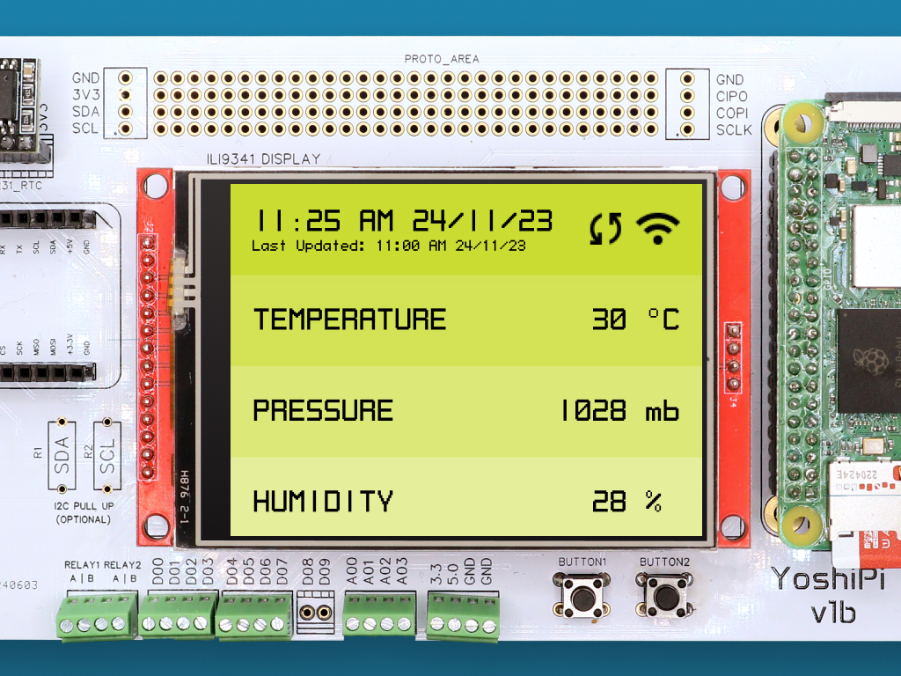

# Yoshipi.Samples

Project Samples:

<table>
    <tr>
        <td>
             
            Basic YoshiPi app with a touch-capable display  
            <a href="Source/Meadow.Desktop/WinForms/">Source Code</a>
        </td>
        <td>
             
            Get weather forecast using Meadow on a YoshiPi  
            <a href="Source/Meadow.Desktop/MauiMeadow/">Source Code</a>
        </td>
        <td>
             
            Send telemetry data to Meadow.Cloud on a YoshiPi  
            <a href="Source/Meadow.Desktop/AvaloniaMeadow/">Source Code</a>
        </td>
    </tr>
    <tr>
        <td>
            
&nbsp;&nbsp;&nbsp;&nbsp;&nbsp;&nbsp;&nbsp;&nbsp;&nbsp;&nbsp;&nbsp;&nbsp;&nbsp;&nbsp;&nbsp;&nbsp;&nbsp;&nbsp;&nbsp;&nbsp;&nbsp;&nbsp;&nbsp;&nbsp;&nbsp;&nbsp;&nbsp;&nbsp;&nbsp;&nbsp;&nbsp;&nbsp;

        </td>
        <td>
            
&nbsp;&nbsp;&nbsp;&nbsp;&nbsp;&nbsp;&nbsp;&nbsp;&nbsp;&nbsp;&nbsp;&nbsp;&nbsp;&nbsp;&nbsp;&nbsp;&nbsp;&nbsp;&nbsp;&nbsp;&nbsp;&nbsp;&nbsp;&nbsp;&nbsp;&nbsp;&nbsp;&nbsp;&nbsp;&nbsp;&nbsp;&nbsp;

        </td>
        <td>
            
&nbsp;&nbsp;&nbsp;&nbsp;&nbsp;&nbsp;&nbsp;&nbsp;&nbsp;&nbsp;&nbsp;&nbsp;&nbsp;&nbsp;&nbsp;&nbsp;&nbsp;&nbsp;&nbsp;&nbsp;&nbsp;&nbsp;&nbsp;&nbsp;&nbsp;&nbsp;&nbsp;&nbsp;&nbsp;&nbsp;&nbsp;&nbsp;

        </td>
    </tr>
</table>